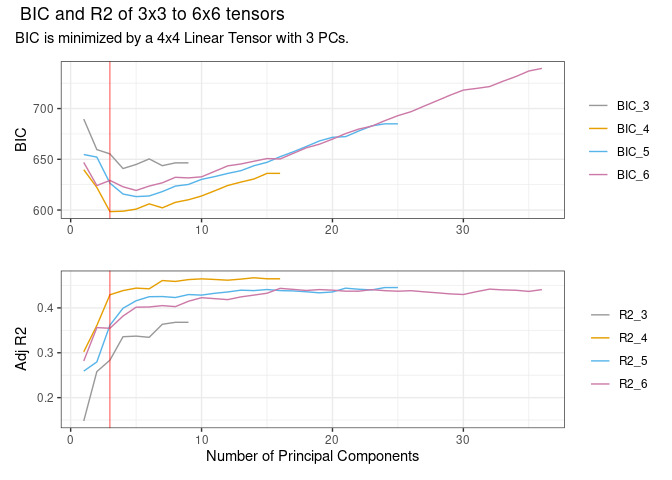

<!-- README.md is generated from README.Rmd. Please edit that file -->

# spatInfer

<!-- badges: start -->
<!-- badges: end -->

The purpose of `spatInfer` is to run spatial regressions that are robust
to trends and autocorrelation in the data, and to provide spatial noise
diagnostics to test the accuracy of the inference method. At the same it
aims to be extremely simple to use, requiring only a sequence of four
commands.

## Installation

You can install the development version of spatInfer from
[GitHub](https://github.com/) with:

``` r
# install.packages("pak")
pak::pak("morganwkelly/spatInfer")
```

## Example

The goal is to run and test a regression with a spatial basis made up of
the first $p$ principal components of a $k \times k$ tensor using
standard errors based on $c$ large clusters. The spatial basis controls
for trends and other large scale structure in the variables, and the
clusters deal with autocorrelation in residuals. We will use data on
intergenerational mobility from Chetty et al

``` r
library(spatInfer)
library(dplyr)
#> 
#> Attaching package: 'dplyr'
#> The following objects are masked from 'package:stats':
#> 
#>     filter, lag
#> The following objects are masked from 'package:base':
#> 
#>     intersect, setdiff, setequal, union
data(opportunity)
set.seed(123)
opportunity=opportunity |> dplyr::slice_sample(n=250)
```

## First Steps

The goal is to run a regression with a spatial basis made up of the
first $p$ principal components of a $k \times k$ tensor and with
standard errors based on $c$ large clusters. The spatial basis controls
for trends and other large scale structure in the variables, and the
clusters deal with autocorrelation in residuals.

The parameters $c$, $k$ and $p$ are estimated with two commands. The
first is `optimal_basis` which includes the formula to be estimated and
the name of the data:

``` r
optimal_basis(mobility~racial_seg+single_mom,
              opportunity,
              max_splines=6)
```



You’ll still need to render `README.Rmd` regularly, to keep `README.md`
up-to-date. `devtools::build_readme()` is handy for this.

You can also embed plots, for example:


In that case, don’t forget to commit and push the resulting figure
files, so they display on GitHub and CRAN.
