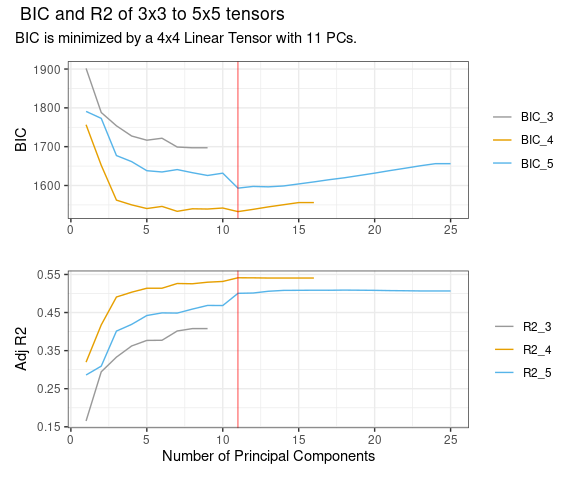

<!-- README.md is generated from README.Rmd. Please edit that file -->

# spatInfer

<!-- badges: start -->
<!-- badges: end -->

Strong autocorrelation and directional trends mean that regressions
using spatial observations are prone to return inflated t-statistics
regardless of the validity of their identification procedure. Conley and
Kelly (2024) introduce two spatial diagnostics to identify potential
problems along with a robust regression procedure. The estimation
procedure involves adding a parsimonious spatial basis to the regression
of interest and carrying out large cluster inference.

## Workflow.

`spatInfer` is based on a sequence of four commands.

1.  `optimal_basis()` gives the spatial basis to include in regressions.

2.  `placebo()` estimates treatment significance from spatial noise
    placebos and chooses the optimal number of large clusters for
    standard error estimation.

3.  `synth()` tests the null hypothesis that the outcome is trending
    spatial noise, and therefore independent of the treatment.

4.  `basis_regression()` runs the regression with the spatial basis and
    large cluster standard errors.

## Worked Example

We begin by loading the `spatInfer` library and the data frame called
`opportunity` which is a subset of the data used by Chetty et al.

``` r
library(spatInfer)

data(opportunity)
head(opportunity)
#>   state   mobility  racial_seg short_commute         X        Y  single_mom
#> 1    TN -0.9781629 -0.39350926    -0.9251255 -82.38073 36.49083 -0.22490551
#> 2    TN -1.0856736 -0.36583220    -1.2674777 -83.38638 35.98694 -0.31351321
#> 3    TN -0.8616746 -0.65469483    -0.6918099 -83.56975 36.58038  0.17500059
#> 4    TN -1.0743196  0.80190824    -1.3225723 -84.19427 36.02330  0.07312777
#> 5    NC -1.2278184  1.32554365    -1.1596027 -80.47461 36.24637  0.35360815
#> 6    VA -1.1704324  0.06764414    -1.0108958 -80.10021 36.68047  0.73870040
```

The outcome variable is inter-generational mobility and we will consider
regressions with racial segregation as the variable of interest and
families with a lone parent as a control. This is spatial data so the
longitude and latitude of each observation are required and must be
called `X` and `Y`.

## 1. Choose the Spatial Basis

The first step is to estimate the optimal spatial basis that best
explains the outcome variable. The spatial basis serves both to remove
long range structure from the data (acting like a systematic version of
the polynomials in longitude and latitude, or continental dummies often
employed in spatial regressions) and to improve inference by allowing
smaller clusters of residuals.

We apply the simplest basis possible: a $k \times k$ tensor of linear
b-splines and, to minimize the loss of degrees of freedom, we select the
first $p$ principal components of the tensor. The first command
\`optimal_basis\` chooses the combination of $k$ and $p$ that minimizes
a Bayes Information Criterion. To make the diagram legible, select the
maximum basis degree that you want to examine. As with most commands in
`R` it starts with the regression formula and the name of the dataset.
Here we will regress intergenerational mobility on racial segregation,
the treatment of interest here, using the fraction of household with
children headed by a lone parent.

The treatment of interest is placed as the first on the right hand side.
If several are of concern the procedure can be repeated using each as
the first entry.

``` r
optimal_basis(mobility~racial_seg+single_mom, 
              opportunity,
              max_splines=5)
```



It can be seen here that the optimal combination is the first 11
principal components of a 4x4 spline. It is notable that this very small
number of spatial controls explains 55% of variability in the outcome.
Knowing only the location of a place lets you make a decent guess about
the likely degree of intergenerational mobility there, without knowing
anything about its other characteristics.

## 2. Run Placebo Test

Having chosen a spatial basis, we now need to choose an optimal number
of clusters for the residuals. If there are too many, residuals will be
correlated between clusters leading to inconsistent standard error
estimates, whereas too few will result in unnecessarily wide confidence
intervals. To choose the optimal number we use spatial noise placebos.

The placebos are constructed to have the same spatial structure as the
treatment, here racial segregation. First, the treatment is regressed on
the spatial basis terms selected in Step 1. The spatial correlation
between the detrended residuals is assumed to decay exponentially so
that the correlation between two at distance $h$ apart is
$\rho \exp (- \theta / h)$.[^1] The parameters $\rho$ and $\theta$ are
referred to as the structure and range of the correlation. Effective
range is $2 \theta$: at this distance correlation equals 0.14. These
parameters are estimated by maximum likelihood using the `fields`
library and then used to estimate synthetic residuals which are added
back onto the predicted treatment values to give the placebo values. The
regression is run repeatedly with simulated placebos in place of the
real treatment and the p-values of each simulation are recorded.

These placebo p-values give us two useful things. The first is a placebo
significance level of the treatment: how often does a placebo have a
lower p-value (higher t-statistic) than the treatment.

The second is that the placebos provide a Monte Carlo simulation to
evaluate the inference procedure used. If substantially more than 5% of
placebo regressions are significant at 5% we can conclude that the
standard error estimate is deficient.

Standard errors are estimated using the large cluster procedure of
Bester, Conley and Hansen, where observations are partitioned into $c$
large clusters using k-medoids. The placebo Monte Carlos allow an
optimal value of $c$ to be picked.

The placebo test is implemented by the command \`placebo\`. Again this
starts off with the formula and data, followed by the tensor degree and
number of principal components just picked by `optimal_basis`, and then
the number of simulations. In practice the simulations settle down
rapidly and 1000 will give accurate results but you should start with
around 200 which will quickly give you a good idea of how your data are
behaving. [^2]

``` r
plbo=placebo(mobility~racial_seg+single_mom, opportunity,
                 splines=4, pc_num=11,
                 nSim=1000
                 )
placebo_table(plbo)
```

| Clusters                                                                                                                                                                                                              | Est p | Plac p | Plac 5% | CI Width | CI               |
|-----------------------------------------------------------------------------------------------------------------------------------------------------------------------------------------------------------------------|-------|--------|---------|----------|------------------|
| HC                                                                                                                                                                                                                    |       |        |         |          |                  |
| .                                                                                                                                                                                                                     | 0     | 0      | 0.23    | 0.63     | \[-1.32, -0.68\] |
| BCH                                                                                                                                                                                                                   |       |        |         |          |                  |
| 3                                                                                                                                                                                                                     | 0.01  | 0.02   | 0.07    | 1.05     | \[-1.52, -0.48\] |
| 4                                                                                                                                                                                                                     | 0.02  | 0.03   | 0.09    | 1.32     | \[-1.66, -0.34\] |
| 5                                                                                                                                                                                                                     | 0.01  | 0.03   | 0.13    | 1.16     | \[-1.58, -0.42\] |
| 6                                                                                                                                                                                                                     | 0     | 0.01   | 0.1     | 1.07     | \[-1.53, -0.47\] |
| Moran=21.56, Structure=0.37, Effective Range=0.1, R2=0.08.                                                                                                                                                            |       |        |         |          |                  |
| Splines=4, PCs=11.                                                                                                                                                                                                    |       |        |         |          |                  |
| Estimated and placebo p values and proportion of placebo regressions significant at 5%, along with confidence intervals. R2 gives the explanatory power of a regression of the treatment on the principal components. |       |        |         |          |                  |

Placebo generates a table where the top row uses heteroskedasticity
consistent standard errors: if spatial correlation in residuals turns
out to be unimportant these are the ones to use. Below this are large
cluster (Bester-Conley-Hansen) standard errors, starting with three and
going up to six. The second column gives the estimated p-value of the
treatment variable from a regression that includes spatial basis terms.
As the number of clusters increases this will generally fall.

The next column gives the placebo p-value: the proportion of simulations
where the placebo had a lower p-value than the real treatment.

Following this, and highlighted in orange, is the percentage of
simulations where the placebo is significant at 5%. If this is markedly
higher than 5% it suggests that the inference method employed was
inadequate. In practice a value in the range of 0.05 to 0.07 or 0.08
indicates satisfactory performance.

The next column gives the width of the confidence interval associated
with each cluster and allows an informal size-power tradeoff: increasing
the proportion above 5% to, say, 8% is desirable if it leads to a marked
narrowing of the confidence interval. In this case here, 3 clusters
gives 7% of simulations significant at 5% suggesting that this is a
reasonable number: by contrast 23% of HC simulations are significant.
The placebo p-value of 0.02 is close to the regression estimate of 0.01
and the confidence interval for the parameter is $[-1.52,-1.48]$,
narrower than that for other large clusters.

It will sometimes happen that the proportion of placebos significant at
5% stays considerably above 5% regardless of the cluster number. In that
case systematically increasing, or sometimes decreasing, the number of
principal components `num_pc` by one or two will usually give a
satisfactory placebo value.

Below the Table are a number of diagnostics and descriptive statistics.
Most important is the Moran statistic, the Z-score of the null
hypothesis that the correlation between each residual and its nearest
neighbours is zero. We use 5 neighbours here: altering this does not
alter the results materially. In our experience, the Moran statistic is
usually well below 2 or substantially above it.[^3]

In deciding whether to use a familiar HC standard error or a large
cluster one we have adopted the rule of thumb that if this has a low
Moran statistic and a 5% placebo value close to 0.05 it should be used,
given its tighter confidence intervals. Otherwise a BCH cluster below
0.08 is picked.

Below the Moran statistic are the spatial parameters. R2 gives the
explanatory power of the regression of the treatment on the spatial
basis variables. Unusually here it is very low: typically the treatment
and outcome share common spatial trends, making any non-spurious
relationship between them difficult to extract from the data. Next is
the structure $\rho$ of the residuals and then the effective range
expressed as a fraction of the maximum distance between points.[^4]

Here it can be seen that structure and effective range are 0.37 and 0.1
respectively. A correlation range of 0.1 might not sound dramatic by
time series standards. However, with spatial data there are far more
points within that range causing small correlations to add up to a large
number. Finally the degree of the tensor and the number of principal
components used to approximate the outcome are reported.

## 3. Run a Synthetic Outcome Test

Following the placebo test, the next step is to calculate the synthetic
outcome p-value: Can we reject the null hypothesis that the outcome is
trending spatial noise, and therefore independent of the treatment?

An important thing about the synthetic outcome test is that it can be
computed in situations where there is a binary treatment so a placebo
test cannot be estimated. In this case it is best to report the p-values
for a range of values from 3 to 5 to allow readers to judge the
robustness of the results.

We assume that the outcome is generated as a quadratic in longitude and
latitude. Noise is generated with using maximum likelihood estimates of
the residuals’ spatial parameters: here there is a structure of 0.91 and
effective range of 0.35.

``` r
synt_bch=synth(mobility~racial_seg+single_mom,  opportunity,
                 splines=4, pc_num=5,
                  nSim=1000)
synth_table(synt_bch)
```

| Clusters                                                                                                                                                                        | Est p | Synth p | CI Width | CI               |
|---------------------------------------------------------------------------------------------------------------------------------------------------------------------------------|-------|---------|----------|------------------|
| HC                                                                                                                                                                              |       |         |          |                  |
| .                                                                                                                                                                               | 0     | 0       | 0.67     | \[-1.34, -0.66\] |
| BCH                                                                                                                                                                             |       |         |          |                  |
| 3                                                                                                                                                                               | 0.01  | 0       | 0.86     | \[-1.43, -0.57\] |
| 4                                                                                                                                                                               | 0.02  | 0.02    | 1.29     | \[-1.64, -0.36\] |
| 5                                                                                                                                                                               | 0.01  | 0.01    | 1.16     | \[-1.58, -0.42\] |
| 6                                                                                                                                                                               | 0.01  | 0.01    | 1.19     | \[-1.59, -0.41\] |
| Moran=21.5, Structure=0.91, Effective Range=0.35, R2=0.33.                                                                                                                      |       |         |          |                  |
| N=709, Splines=4, PCs=5.                                                                                                                                                        |       |         |          |                  |
| Estimated and synthetic outcome p values for different cluster numbers. R2 gives the explanatory power of a regression of the outcome on a quadratic in longitude and latitude. |       |         |          |                  |

For the three clusters chosen by the placebo test, the synthetic outcome
significance level is 0.02, identical to the placebo one.

## 4. Estimate the Spatial Basis Regression

The fact that the placebo and synthetic outcome significance levels
closely match the regression one gives us considerable confidence in the
reliability of the regression estimate. We therefore estimate a
regression with 11 principal components of a 4x4 spline, and compute
standard errors using 3 k-medoids clusters.

Because the 5% significance level of a t-statistic with two degrees of
freedom is 4.3, and the familiar t-statistic of 2 has a p-value of 0.18
we report 95% confidence intervals and p-values for each variable.

For comparison we also include a regression with no spatial adjustment
where standard errors are clustered by state, the standard practice in
such studies.

``` r
Basis=basis_regression(mobility~racial_seg+single_mom,  opportunity,
                 splines=4,pc_num=5,
                 clusters=3)

Clust=fixest::feols(mobility~racial_seg+single_mom,  opportunity,
              cluster= ~state)

modelsummary::modelsummary(list(Clustered=Clust, Basis=Basis),
                           statistic = c("conf.int","p = {p.value}"),
                           coef_omit = c("Intercept|PC*"), #omit basis and intercept
                           gof_map = c("nobs", "r.squared"),
                            fmt=2)
```

|            | Clustered        | Basis            |
|------------|------------------|------------------|
| racial_seg | -0.09            | -0.13            |
|            | \[-0.16, -0.02\] | \[-0.18, -0.07\] |
|            | p = 0.01         | p = \<0.01       |
| single_mom | -0.75            | -0.54            |
|            | \[-0.91, -0.59\] | \[-0.97, -0.11\] |
|            | p = \<0.01       | p = 0.03         |
| Num.Obs.   | 709              | 709              |
| R2         | 0.590            | 0.767            |

Here we use `modelsummary` to tabulate the results but the output will
work with any other standard `R` table package.

It can be seen here that, despite the strong spatial trends in the data,
adding a spline basis and using only three clusters does not alter the
results markedly compared with naive clustering by state.

## Installation

You can install the development version of spatInfer from
[GitHub](https://github.com/) with:

``` r
# install.packages("pak")
pak::pak("morganwkelly/spatInfer")
```

## Tutorial

A step by step tutorial can be found
[here](https://morganwkelly.github.io/spatInfer_tutor/)

[^1]: The exponential is a special case of the Matern function with
    smoothness parameter of 0.5, and in principle the optimal smoothing
    parameter can be chosen by maximum likelihood. In practice this
    makes little difference: as smoothness increases the estimated range
    $\theta$ falls, leaving correlation more or less unchanged.

[^2]: For large datasets, estimating the necessary Cholesky
    decomposition of the correlation matrix and the k-medoids clusters
    can be time-consuming, and fast approximations can be used by
    setting `k_medoids=FALSE` and `exact_cholesky=FALSE` in the
    `placebo` command.

[^3]: See Table 3 in Conley and Kelly.

[^4]: To be precise: the 95th percentile of distance. This prevents
    distortion from spatial outliers.
