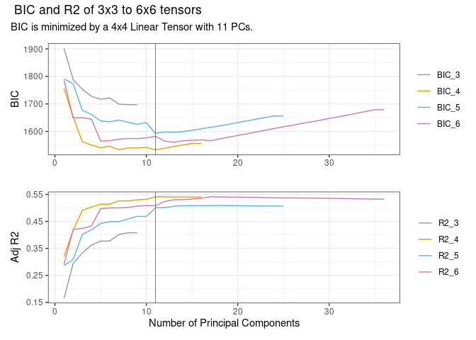

<!-- README.md is generated from README.Rmd. Please edit that file -->

# spatInfer

<!-- badges: start -->
<!-- badges: end -->

The purpose of `spatInfer` is to run spatial regressions that are robust
to trends and autocorrelation in the data, and to provide spatial noise
diagnostics to test the accuracy of the inference method. At the same it
aims to be extremely simple to use, requiring only a sequence of four
commands.

## Installation

You can install the development version of spatInfer from
[GitHub](https://github.com/) with:

``` r
# install.packages("pak")
pak::pak("morganwkelly/spatInfer")
```

A detailed tutorial can be found at
[Tutorial](https://morganwkelly.github.io/spatInfer_tutor/)

## Example

The goal is to run and test a regression with a spatial basis made up of
the first $p$ principal components of a $k \times k$ tensor using
standard errors based on $c$ large clusters. The spatial basis controls
for trends and other large scale structure in the variables, and the
clusters deal with autocorrelation in residuals. We will use data on
intergenerational mobility from Chetty et al

``` r
library(spatInfer)
library(dplyr)
#> 
#> Attaching package: 'dplyr'
#> The following objects are masked from 'package:stats':
#> 
#>     filter, lag
#> The following objects are masked from 'package:base':
#> 
#>     intersect, setdiff, setequal, union
data(opportunity)
```

## First Steps

The goal is to run a regression with a spatial basis made up of the
first $p$ principal components of a $k \times k$ tensor and with
standard errors based on $c$ large clusters. The spatial basis controls
for trends and other large scale structure in the variables, and the
clusters deal with autocorrelation in residuals.

The parameters $k$ and $p$ are chosen with `optimal_basis` which
includes the formula to be estimated and the name of the data:

``` r
optimal_basis(mobility~racial_seg+single_mom,
              opportunity,
              max_splines=6)
```



It can be seen that the optimal number of splines $k$ is 4, and optimal
number of principal components $p$ is 11.

Next we run `placebo` which generates spatial noise placebos with the
same structure as `racial_seg`. This gives placebo values for
heteroskedasticity consistent `HC` standard errors and large cluster BCH
ones.

``` r
plbo_bch=placebo(mobility~racial_seg+single_mom,  opportunity,
                 splines=4,
                 pc_num=11,
                 nSim=1000)
placebo_table(plbo_bch)
```

| Clusters                                                                                                                                                                                                              | Est p | Plac p | Plac 5% | CI Width | CI               |
|-----------------------------------------------------------------------------------------------------------------------------------------------------------------------------------------------------------------------|-------|--------|---------|----------|------------------|
| HC                                                                                                                                                                                                                    |       |        |         |          |                  |
| .                                                                                                                                                                                                                     | 0     | 0      | 0.12    | 0.67     | \[-1.34, -0.66\] |
| BCH                                                                                                                                                                                                                   |       |        |         |          |                  |
| 3                                                                                                                                                                                                                     | 0.02  | 0.04   | 0.09    | 1.28     | \[-1.64, -0.36\] |
| 4                                                                                                                                                                                                                     | 0.03  | 0.04   | 0.09    | 1.57     | \[-1.79, -0.21\] |
| 5                                                                                                                                                                                                                     | 0.01  | 0.02   | 0.06    | 1.33     | \[-1.67, -0.33\] |
| 6                                                                                                                                                                                                                     | 0     | 0      | 0.07    | 0.96     | \[-1.48, -0.52\] |
| Moran=7.9, Structure=0.4, Effective Range=0.1, R2=0.08.                                                                                                                                                               |       |        |         |          |                  |
| Splines=4, PCs=11.                                                                                                                                                                                                    |       |        |         |          |                  |
| Estimated and placebo p values and proportion of placebo regressions significant at 5%, along with confidence intervals. R2 gives the explanatory power of a regression of the treatment on the principal components. |       |        |         |          |                  |
